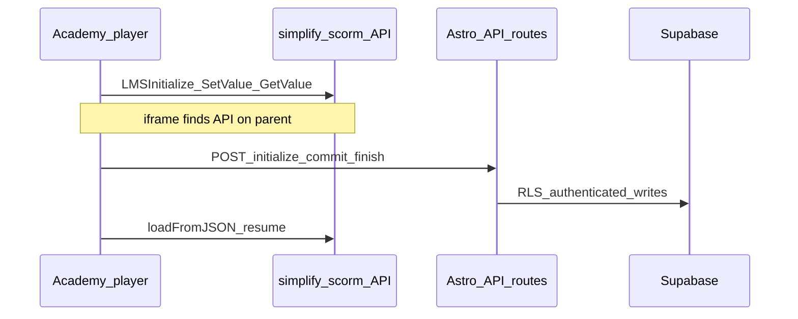

# SCORM API persistence and Supabase schema

## Current baseline (important)

- **[`astro.config.ts`](astro.config.ts)** uses `output: 'static'`. Astro **`/api/*` routes do not run** in a fully static deploy; the checklist’s three endpoints require **`output: 'hybrid'`** (or `server`) plus a host adapter.
- **[`netlify.toml`](netlify.toml)** publishes `dist` with a static build—plan on **`@astrojs/netlify`** so API routes become Netlify Functions.
- **[`src/pages/academy/view/[courseId].astro`](src/pages/academy/view/[courseId].astro)** already:
  - Loads **simplify-scorm** (CDN scripts) so `window.API` is a full SCORM 1.2 implementation with **`cmi`**, **`loadFromJSON`**, **`toJSON`**, and **`window.API.on('LMSSetValue', ...)`** (not the minimal `{ data: {} }` object from the spec).
  - Persists **`suspend_data`**, **score**, **`progress_percent`** by **`academySupabase.from('progress').upsert(...)`** from the **browser** ([`src/lib/academy.ts`](src/lib/academy.ts) uses `@supabase/supabase-js` only; no `@supabase/ssr`, no middleware).
- **[`public/courses/ai_fundamentals/scorm-api.js`](public/courses/ai_fundamentals/scorm-api.js)** shows published content calling **`API.LMSInitialize` / `LMSSetValue` / `LMSGetValue`** against the parent `window.API`—replacing simplify-scorm with a naive flat shim would **break** unless you re-implement the full CMI tree and getters.

**Recommendation:** Treat the spec’s “flat `window.API`” as the **conceptual** model; **keep simplify-scorm** as the runtime API and implement **persistence + interaction extraction** on top of `cmi.toJSON()` and/or `LMSSetValue` logging. Only reconsider a custom shim if an export inspection proves the package needs nothing beyond bare LMS calls (unlikely for SCORMcraft-style content).



---

## Phase 0 — Export inspection (do first)

**Goal:** Decide Scenario A (`cmi.interactions.N.*`) vs B (quiz state only in `cmi.suspend_data`).

- Load a **SCORMcraft test export** in dev with the existing player.
- Temporarily log **`window.API.cmi.toJSON()`** on each `LMSSetValue` / `LMSCommit` (you already subscribe to **`window.API.on('LMSSetValue', ...)`** in [`[courseId].astro`](src/pages/academy/view/[courseId].astro) ~508–516).
- Capture whether **`interactions`** appears in JSON and what **`suspend_data`** contains (string vs embedded JSON).

Outcome drives commit-handler complexity: structured interaction rows only if A; otherwise store **`suspend_data`** + optional server-side parser once the blob format is known.

---

## Phase 1 — Supabase schema and RLS

Add a migration (repo currently has **no `supabase/migrations/*.sql`**; follow your existing manual SQL style like [`supabase/rls-leads-for-web-form.sql`](supabase/rls-leads-for-web-form.sql) or adopt CLI migrations).

**Tables** (match your spec, plus one operational column):

- **`enrollments`**: `id`, `user_id` → `auth.users`, `course_id`, `enrolled_at`, `unique(user_id, course_id)`.
- **`scorm_sessions`**: `id`, `enrollment_id` → `enrollments`, `started_at`, `finished_at`, `is_complete`, `score`, `lesson_status`, `lesson_location`, `suspend_data`, `session_time`, **`raw_cmi jsonb`**, **`updated_at timestamptz`** (default `now()`, bumped on each commit—needed for compat with legacy `progress` and debugging).
- **`quiz_responses`**: `id`, `session_id` → `scorm_sessions`, interaction fields, `recorded_at`.

**RLS:** `authenticated` only; policies that restrict rows by **`auth.uid() = user_id`** via join to `enrollments`. No anon access.

### Session selection rule for `POST /api/scorm/initialize` (locked)

Applies per **`enrollment`** (not per launch blindly):

1. Find the **latest** `scorm_sessions` row for that enrollment, ordered by **`started_at` descending**.
2. **If** that row exists **and** **`is_complete = false`** → **resume it**: return its `id` as `sessionId` and return CMI snapshot for `loadFromJSON`.
3. **Else** (no rows, or latest is complete) → **insert a new** `scorm_sessions` row and return its `id` and empty/default CMI.

This yields **natural attempt tracking** (each completed course creates a boundary; next launch starts a new attempt), avoids **orphaned incomplete rows**, and does **not** create a new session on every page refresh while the learner is mid-attempt.

### `progress` compatibility view (define before removing legacy writes)

The app today reads **`progress`** with columns **`user_id`**, **`course_id`**, **`suspend_data`**, **`score`**, **`progress_percent`**, **`updated_at`** ([player](src/pages/academy/view/[courseId].astro) select/upsert; [dashboard](src/pages/academy/dashboard.astro) selects `course_id, progress_percent`).

**Ship this view in the same migration as the new tables** (or immediately after backfill), **before** player/dashboard stop querying the old table:

```sql
-- One row per enrollment: "active" session = prefer latest incomplete, else latest session overall.
-- Mirrors legacy progress shape so existing selects keep working during cutover.
create or replace view public.progress_compat as
with sessions_ranked as (
  select
    s.id,
    s.enrollment_id,
    s.suspend_data,
    s.score,
    s.raw_cmi,
    s.updated_at,
    s.started_at,
    s.is_complete,
    e.user_id,
    e.course_id,
    row_number() over (
      partition by s.enrollment_id
      order by s.is_complete asc, s.started_at desc
    ) as rn_pick
  from public.scorm_sessions s
  join public.enrollments e on e.id = s.enrollment_id
)
select
  sr.user_id,
  sr.course_id,
  coalesce(sr.suspend_data, '') as suspend_data,
  coalesce(sr.score, 0) as score,
  least(
    100,
    greatest(
      0,
      round(coalesce(sr.score, (sr.raw_cmi #>> '{core,score,raw}')::numeric, 0))::int
    )
  ) as progress_percent,
  coalesce(sr.updated_at, sr.started_at) as updated_at
from sessions_ranked sr
where sr.rn_pick = 1;
```

**Notes when implementing:**

- **`progress_percent`**: Legacy player used **`round(rawScore)`** with **`rawScore`** from **`cmi.core.score.raw`**, clamped 0–100. The view uses **`scorm_sessions.score`** first, then falls back to **`raw_cmi->core->score->raw`** so rows still compute if only JSON was stored.
- **Rename for cutover:** You can **`create view public.progress as select ...`** only after **`drop table`** / renaming legacy **`progress`**—avoid two objects named `progress`. Until then, point app code at **`progress_compat`** (or rename once).

**RLS:** Grant `select` on the view to `authenticated` with a policy equivalent to “row visible if `user_id = auth.uid()`”, or query only through a **security invoker** view—verify Supabase behavior (views run as invoker by default in Postgres 15+; confirm RLS on base tables applies).

### Migration from today’s `progress` table

**Dual-write (time-boxed):**

- **When dual-write starts:** Record **`dual_write_start_date`** in the project doc or ticket (the day you ship player writes to **both** legacy `progress` and new sessions/API).
- **Cutover:** Record **`progress_cutover_date = dual_write_start_date + N calendar days`** at the **same** moment—**N** should be explicit (e.g. **14**). On **`progress_cutover_date`**: switch dashboard + player reads to **`progress_compat`** (or final view name), stop writes to legacy **`progress`**, then drop or archive legacy table after validation.

Do **not** leave dual-write indefinite—lint tends to make “short periods” permanent.

---

## Phase 1b — Auth uplift (prerequisite; scoped separately from SCORM)

**Cookie-based `@supabase/ssr` + middleware** is a **cross-cutting** change: [`src/lib/academy.ts`](src/lib/academy.ts), **[`src/pages/academy/login.astro`](src/pages/academy/login.astro)**, **[`src/pages/academy/dashboard.astro`](src/pages/academy/dashboard.astro)**, **[`src/pages/academy/view/[courseId].astro`](src/pages/academy/view/[courseId].astro)**, and any other Supabase **`createClient`** usage must move to the **browser/server split** pattern so the **same session** is visible in API routes.

**Rule:** Complete this **project** (or a minimal vertical slice: login + session refresh + one protected read) **before** implementing **`POST /api/scorm/*`**—otherwise every SCORM endpoint would need ad-hoc JWT parsing or duplicate auth hacks.

Deliverables for this slice:

- **`createBrowserClient`** (or SSR helper) for academy pages; **`createServerClient`** in **`src/middleware.ts`** to refresh cookies on navigation.
- Regression check: login, dashboard progress load, player load **unchanged** for users.

**Phase 2** below assumes this is **done**.

---

## Phase 2 — Astro hybrid + authenticated API routes

1. **Dependencies:** Already using **`@supabase/ssr`** from Phase 1b; add **`@astrojs/netlify`** (matches [`netlify.toml`](netlify.toml)).
2. **`astro.config.ts`:** Set `output: 'hybrid'`, add Netlify integration, keep prerendering for marketing pages (default); opt **API routes** into `export const prerender = false`.
3. **Implement three endpoints** under `src/pages/api/scorm/` (session cookie available via Phase 1b middleware):
   - **`initialize`:** Upsert **`enrollments`**; apply **session selection rule** (above); return **`sessionId`** + **CMI snapshot** for `loadFromJSON`.
   - **`commit`:** Upsert **`raw_cmi`**, scalar columns, **`suspend_data`**, bump **`updated_at`**; **parse `cmi.interactions.*`** into **`quiz_responses`** when Scenario A; if B, store blob only (optional parser later).
   - **`finish`:** Set `finished_at`, `is_complete`, final score/status.

**Authorization:** Every handler must verify the user matches the enrollment **`user_id`** for the supplied `sessionId` / `courseId`.

**Alternative (if hybrid Netlify is off the table):** Same handlers as **Supabase Edge Functions** with JWT verification—same DB logic, different transport.

---

## Phase 3 — Player integration (Astrowind)

In [`src/pages/academy/view/[courseId].astro`](src/pages/academy/view/[courseId].astro):

1. **Resume flow:** After auth, call **`POST /api/scorm/initialize`** with `courseId`, then **`window.API.loadFromJSON(...)`** from the response (replace or augment the current **`progress`** / **`progress_compat`** read ~451–462 during cutover).
2. **Save flow:** On `LMSSetValue` / `LMSCommit` / `LMSFinish` / `beforeunload`, **`fetch`** **`/api/scorm/commit`** and **`/api/scorm/finish`** with **`sessionId`** and **`cmi.toJSON()`** (not a hand-maintained `data` map—unless you drop simplify-scorm).
3. **Interaction buffering:** If Scenario A, either parse **`cmi.interactions`** from **`toJSON()`** on the server (simplest) or buffer **`cmi.interactions.N.*`** key paths client-side; server remains source of truth.
4. **Iframe timing:** Keep simplify-scorm scripts **above** the iframe; optionally **defer setting `iframe.src`** until after `initialize` + `loadFromJSON` to avoid a race where the SCO initializes before resume data exists.

---

## Phase 4 — Dashboard and UX

- **Before** removing legacy **`progress`** writes: dashboard must read from **`progress_compat`** (or the renamed production view) so **`course_id` / `progress_percent`** behavior matches today ([`dashboard.astro`](src/pages/academy/dashboard.astro) ~241–250).
- On **`progress_cutover_date`**: remove dual-write, drop/rename legacy table as planned.
- Document env vars for Netlify: same `PUBLIC_SUPABASE_*`; **cookie** auth (Phase 1b) must work in production (site URL, redirect URLs).

---

## Risk register

| Risk | Mitigation |
|------|------------|
| Replacing simplify-scorm with a minimal shim | Do not; keep simplify-scorm unless Phase 0 proves otherwise |
| Static hosting blocks `/api/*` | Hybrid + Netlify adapter or Edge Functions |
| Quiz data only in `suspend_data` | Store raw + inspect format; parse in a second iteration |
| SSR auth refactor balloons scope | Phase 1b as explicit prerequisite; finish before SCORM API routes |
| Dual-write never ends | Fixed **cutover_date** at dual-write start |
| Dashboard breaks on cutover | **`progress_compat`** view defined and deployed **before** stopping legacy reads |
| Duplicate `dashboard.astro` paths in git | Normalize to a single file when touching the dashboard |
